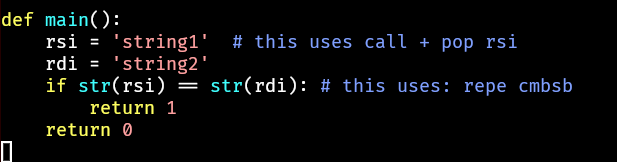
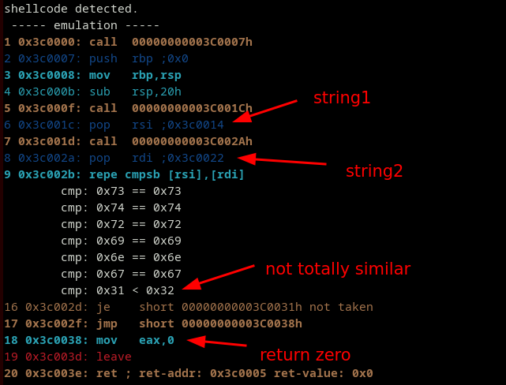
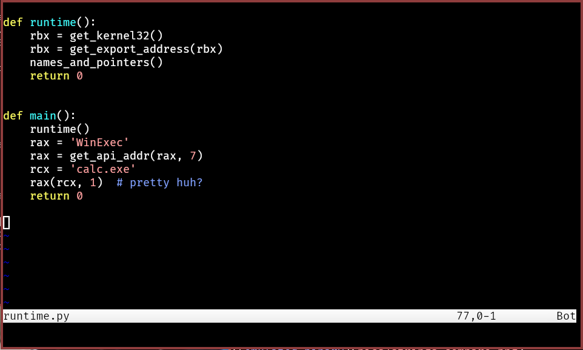
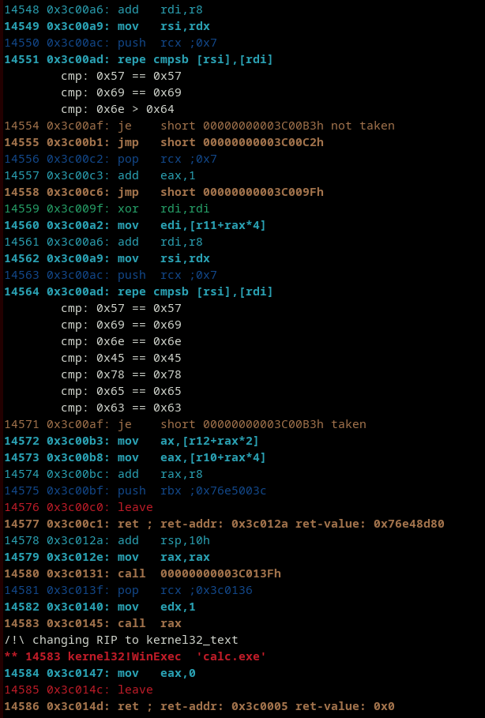
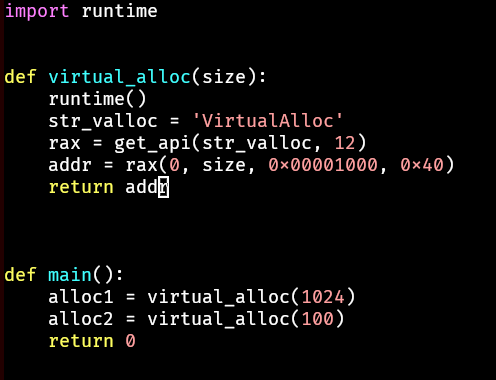
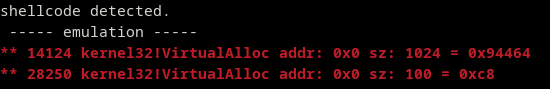

# pynasm

python to nasm assembly conversion, with cpu control.
- x86 64bits only for now.

This allows to create:
- shellcodes
- PIC relocatable low-level code 
- infections (for red-teaming)
- obfuscation


## Disclaimer

Don't use this for creating malicious payloads!

## Usage

```bash
python3 pynasm.py shellcode.py
nasm -f bin shellcode.nasm
```

## Emulate with SCEMU for testing

```bash
./scemu -f shellcode -vv -6
```

## Examples

check the examples folder.


### Control blocks


### Comparing strings






### API Call











## TODO:

- use pushad/popad on prologe/epiloge to isolate registers on functions
- support local vars?


