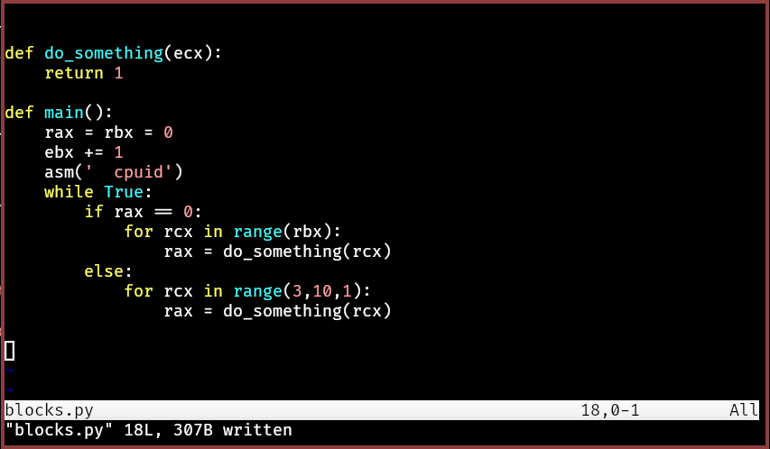
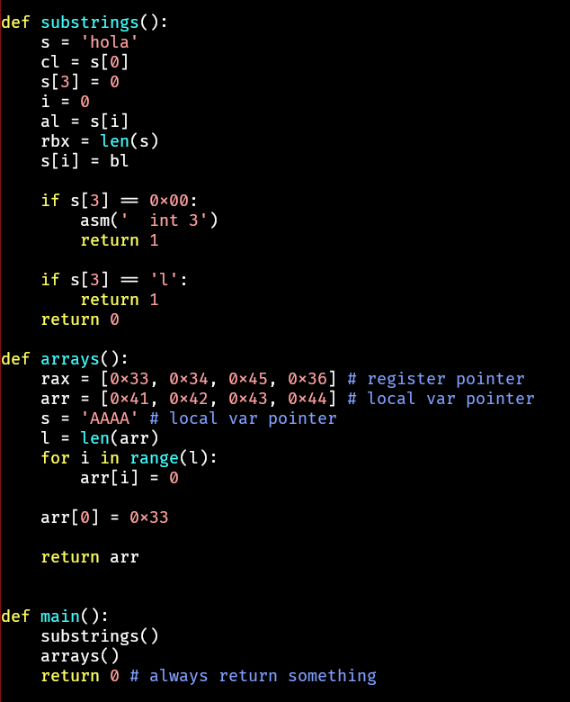

# pynasm

python to nasm assembly conversion, with cpu control.
- x86 64bits only for now.

This allows to create:
- shellcodes
- PIC relocatable low-level code 
- infections (for red-teaming)
- obfuscation


## Disclaimer

Don't use this for creating malicious payloads!

## Usage

generating a relocatable 64bits code blob

```bash
python3 pynasm.py shellcode.py
nasm -f bin shellcode.nasm
ls shellcode
```

or generating an 64bits exe 

```hash
python3 pynasm.py program.py exe
nasm -f win64 program.nasm
x86_64-w64-mingw32-ld program.obj
ls a.exe
```


## Emulate with SCEMU for testing

```bash
./scemu -f shellcode -vv -6
```

## Demo

https://www.youtube.com/watch?v=o072bXNtxmg

## Examples

check the examples folder.


### WinapiAcces importing winapi lib


### Control blocks



### Comparing strings


### API Call


### Arrays and memory blobs 





## TODO:

- complex ifs and/or
- elif
- break
- continue
- structures


